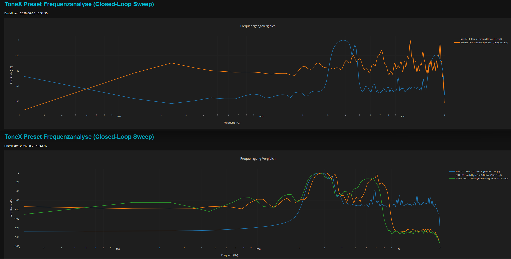

# ToneX Frequency Analyzer & QA Suite

> Hybrid audio analysis & QA suite for ToneX hardware. Combines a Python DSP engine for automated sweep/guitar frequency analysis with a native JUCE C++ application for real-time rig testing and interactive HTML reporting.

---

## Features

* **Closed-Loop Sweep Measurement:** Precise frequency response analysis using logarithmic sweeps, inverse filtering, and peak delay detection.
* **Live Guitar Testing:** Real-time capture and normalization modes for testing actual playing dynamics.
* **Equipment Safety:** Real-time detection of signal anomalies and clipping to protect monitors and speakers (like HeadRush).
* **Interactive HTML Reports:** Export high-resolution comparison charts powered by **Plotly**, complete with custom preset labels (e.g., Vox AC30, SLO Lead, Fender Twin). Check out the sample files in the [`example_logs/`](example_logs/) folder!
* **Hybrid Architecture:**
  * `qa_suite/`: Python-based DSP engine, visualization, and reporting.
  * `juce_plugin/`: Native C++ application for high-performance audio handling.

---

## Preview / Example Report

<p align="center">
  
</p>

---

## Project Structure

```text
├── qa_suite/            # Python DSP engine & analysis tools
├── juce_plugin/         # Native JUCE C++ application
├── cmake/               # CMake configuration files
├── example_logs/        # Interactive HTML reports for offline viewing
├── assets/              # Visual assets & screenshots for documentation
├── CMakeLists.txt       # Root CMake build configuration
└── .gitignore